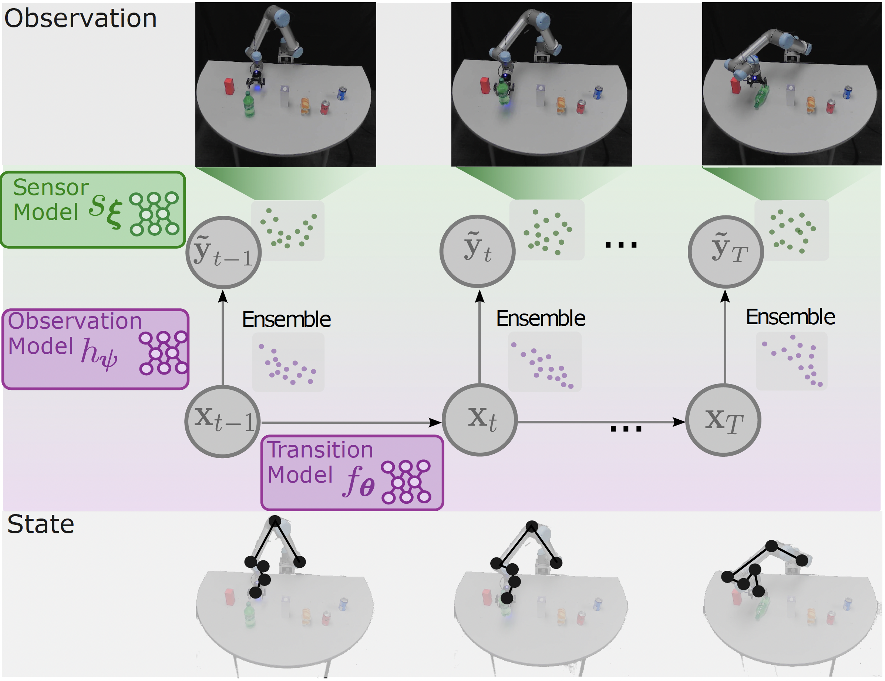
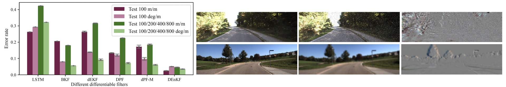
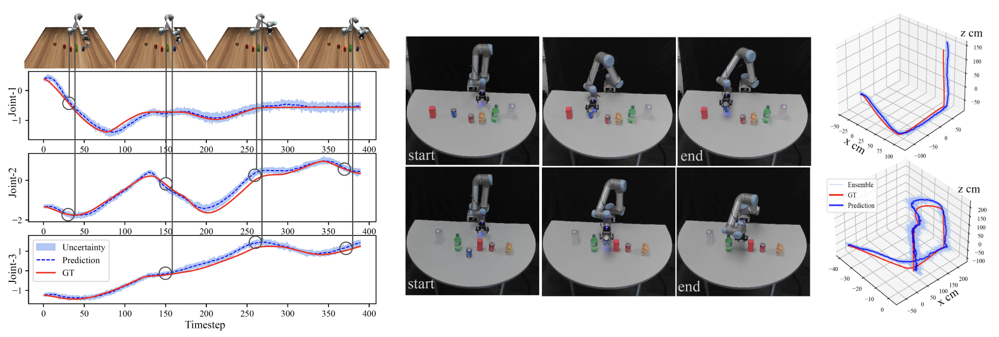

# Differentiable Ensemble Kalman Filters
This repository is the official implementation of the paper "Enhancing State Estimation in Robots: A Data-Driven Approach with Differentiable Ensemble Kalman Filters", which has been accepted to 2023 IEEE/RSJ International Conference on Intelligent Robots and Systems (IROS 2023)

<!-- This paper introduces a novel state estimation framework for robots using differentiable ensemble Kalman filters (DEnKF). DEnKF is a reformulation of the traditional ensemble Kalman filter that employs stochastic neural networks to model the process noise implicitly. Our work is an extension of previous research on differentiable filters, which has provided a strong foundation for our modular and end-to-end differentiable framework. This framework enables each component of the system to function independently, leading to improved flexibility and versatility in implementation. Through a series of experiments, we demonstrate the flexibility of this model across a diverse set of real-world tracking tasks, including visual odometry and robot manipulation. Moreover, we show that our model effectively handles noisy observations, is robust in the absence of observations, and outperforms state-of-the-art differentiable filters in terms of error metrics. Specifically, we observe a significant improvement of at least 59% in translational error when using DEnKF with noisy observations. Our results underscore the potential of DEnKF in advancing state estimation for robotics. -->

<p align="center">

</p>

DEnKF is a reformulation of the traditional ensemble Kalman filter that employs stochastic neural networks to model the process noise implicitly. Our work is an extension of previous research on differentiable filters, which has provided a strong foundation for our modular and end-to-end differentiable framework. This framework enables each component of the system to function independently, leading to improved flexibility and versatility in implementation. Through a series of experiments, we demonstrate the flexibility of this model across a diverse set of real-world tracking tasks, including visual odometry and robot manipulation. Moreover, we show that our model effectively handles noisy observations, is robust in the absence of observations, and outperforms state-of-the-art differentiable filters in terms of error metrics. Specifically, we observe a significant improvement of at least 59% in translational error when using DEnKF with noisy observations. Our results underscore the potential of DEnKF in advancing state estimation for robotics.

## Tutorials and Documentation
A set of tutorials and documentation about DEnKF has been provided in the following Jupyter Notebooks:
1. [Data Preparation with Example](https://github.com/ir-lab/DEnKF/blob/main/pyTorch/1.%20Data%20Preparation%20with%20Example.ipynb)
2. [Quick Start with DEnKF](https://github.com/ir-lab/DEnKF/blob/main/pyTorch/2.%20Quick%20Start%20with%20DEnKF.ipynb)
3. [Train the model](https://github.com/ir-lab/DEnKF/blob/main/pyTorch/3.%20Train%20the%20model.ipynb)
4. [Evaluation](https://github.com/ir-lab/DEnKF/blob/main/pyTorch/4.%20Evaluation.ipynb)


## Getting Started
We provide two implementations using `Pytorch` and `Tensorflow`. Docker workflow remains the same for both implementations.

#### 1. docker workflow

Clone the repo `git clone https://github.com/liuxiao1468/DEnKF.git` and then set the environment variables.
Edit the `conf.sh` file to set the environment variables used to start the docker 
containers. 

```
IMAGE_TAG=  # unique tag to be used for the docker image.
CONTAINER_NAME=UR5  # name of the docker container.
DATASET_PATH=/home/xiao/datasets/  # Dataset path on the host machine.
CUDA_VISIBLE_DEVICES=0  # comma-separated list of GPU's to set visible.
```
Build the docker image by running `./build.sh`.


#### 2. Training or testing - PyTorch
Create or a modify a yaml file found in `./pyTorch/config/xxx.yaml` 
with the appropriate parameters. Set the mode parameter to perform the 
training or testing routine. 

```
mode:
    mode: 'train'  # 'train' | 'test'
```

Run the training and test script using the bash file `./run_filter.sh $CONFIG_FILE` 
where `$CONFIG_FILE` is the path to the config file. e.g. 
`./run_filter.sh ./config/xxx.yaml`. View the logs with `docker logs -f $CONTAINER_NAME`

#### 3. Training or testing - Tensorflow
After setting appropriate parameters for `UR5/run_filter.py` or `KITTI/run_filter.py`.
Run the training or testing script using the bash file `./run_filter.sh`. View the logs with `docker logs -f $CONTAINER_NAME`

#### 4. Tensorboard

Use the docker logs to copy the tensorboard link to a browser

```docker logs -f $CONTAINER_NAME-tensorboard```
 
#### 5. Without Docker

- `PyTorch`: If you don't want to use the docker container for training, you may directly use the `train.py` script and pass in the config file. Make sure to have corresponding libraries and dependencies installed on your local machine. Plase refer to `requirement.txt` and `Dockerfile` for those required packages.
Go to `./UR5` and then
Run `python train.py --config ./config/xxx.yaml`

- `Tensorflow`: you may directly run `./Tensorflow/UR5/run_filter.py` with appropriate parameters. 


## Models
In this project, we present an end-to-end learning approach for recursive filtering that simultaneously learns the observation, dynamics, and noise characteristics of a robotic system. The key contributions of our work can be summarized as follows:
- A stochastic state transition model that uses samples from the posterior of a neural network to implicitly model the process noise, avoiding the need for a parametric representation of the posterior.
        
- An ensemble formulation that allows for the efficient inference of both linear and nonlinear systems, without the need for an explicit covariance matrix, making it suitable for high-dimensional inputs and noisy observations.
    
- Empirical evaluations for the autonomous driving task show DEnKF effectively reduce the translational and rotational errors compared to state-of-the-art methods, reducing errors by up to 59\% and 36\% when dealing with noisy observations, and handling missing observation scenarios with improved error reductions by 2-fold and 3-fold.


## Datasets
1. Simulated Car Tracking Dataset
https://huggingface.co/datasets/liuxiao1468/simulation_car_dataset
2. KITTI Visual Odometry Dataset
https://www.cvlibs.net/datasets/kitti/eval_odometry.php
3. sim2real UR5 Dataset
is available upon request. (Yifan: yzhou298@asu.edu)


## Results

### Visual Odometry Task
<p align="center">

</p>
We assess the performance of state estimation using an 11-fold cross-validation withholding 1 trajectory at each time. We report the root mean squared error (RMSE), mean absolute error (MAE), and the standard KITTI benchmark metrics, the translational error (m/m), and the rotational error (deg/m). The error metrics are computed from the test trajectory over all subsequences of 100 timesteps, and all subsequences of 100, 200, 400, and 800 timesteps. Figure above shows the performance of DEnKF and other differentiable filtering techniques, and the input images to the model.

### UR5 Task
<p align="center">

</p>
The experimental results of UR5 manipulation task indicate that DEnKF are capable of achieving domain adaptation by fine-tuning the simulation framework for real-world scenarios.  Notably, the DEnKF with sim-to-real transfer achieves accurate state estimation, resulting in a reduction of 29% in MAE for joint angle space and 33% for end-effector (EE) positions when compared to the baselines. The DEnKF with sim-to-real transfer exhibits an average of 2.6cm offset (MAE) from the ground truth for EE positions across testing sequences. We further analyze the state tracking in EE space by visualizing the EE trajectories in 3D, as depicted in Figure, where the fine-tuned DEnKF is utilized to estimate the state with two real-robot test examples of action sequence "pick up" and "put down".

## Citation
* Please cite the paper if you used any materials from this repo, Thanks.
```
TBD
```

